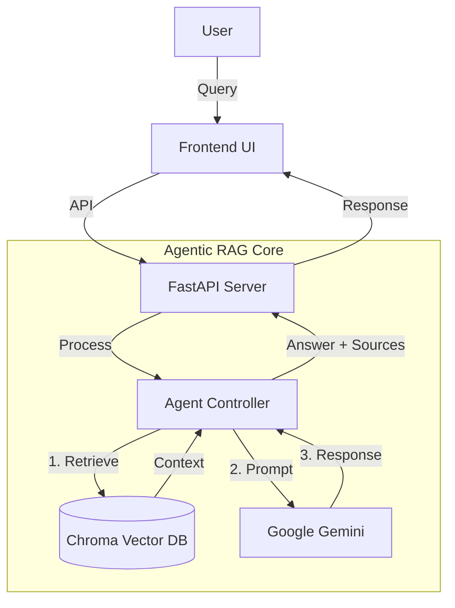
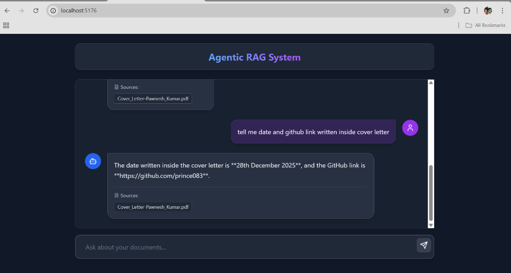
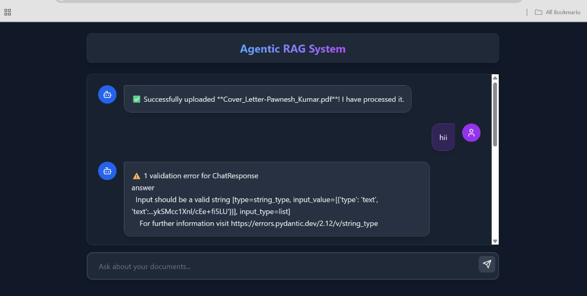

# Advanced Agentic RAG System

## Project Goal
Build an AI system that can reason over PDFs/DOCs, cite sources, remember context, and take actions.

## 🚀 Features
- **Document Ingestion**: Upload PDF & DOCX files.
- **Smart Chunking**: Automatically splits documents into semantic chunks (800 chars).
- **Vector Search**: Semantic retrieval using **Google Gemini Embeddings** (`text-embedding-004`).
- **LLM Reasoning**: Answers questions using **Google Gemini Flash**.
- **Citations**: Returns exact source documents for every answer.
- **Modern UI**: React + Vite + Tailwind CSS Dark Mode interface (10MB upload limit).

## 🛠️ Tech Stack
- **Backend**: FastAPI (Python)
- **Frontend**: React, Vite, Tailwind CSS
- **LLM/Embeddings**: Google Gemini API
- **Vector DB**: ChromaDB (Local persistence)
- **Orchestration**: LangChain

## ✅ Completed Features
- **Project Architecture**: Scalable FastAPI backend with ChromaDB vector storage.
- **Document Ingestion**: Robust pipeline for processing PDF and DOCX files.
- **Smart Chunking**: Automatic text splitting into semantic segments (800 chars).
- **Semnatic Search**: High-performance retrieval using **Google Gemini Embeddings**.
- **RAG Engine**: Context-aware answering using **Gemini Flash**.
- **Modern UI**: Polished React frontend with Citation support and Dark Mode.

## 🚀 Upcoming Features
- **Conversation Memory**: Enabling the agent to remember context across multiple turns.
- **Agentic Capabilities**: Allowing the AI to make decisions and use tools autonomously.
- **Action Execution**: Connecting to external APIs (e.g., Email, Calendar).
- **Voice Interaction**: Adding Speech-to-Text and Text-to-Speech layers.
- **Deployment**: containerization and cloud hosting configuration.

## Architecture Diagram

## Setup & Run
1. `setup_env.bat` (First time)
2. Add `GOOGLE_API_KEY` to `.env`
3. Run Backend: `venv\Scripts\python -m uvicorn app.main:app --port 8000 --reload`
4. Run Frontend: `cd frontend && npm run dev`

## 📸 Screenshots
### Intelligent RAG with Error Handling

### Robust Validation & Feedback

